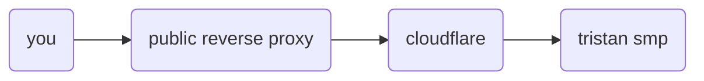
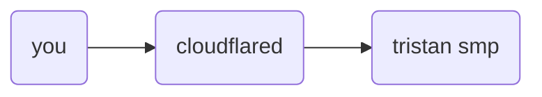

> **Warning**: No longer maintained due to TSMP not being home hosted anymore and instead hosted in the cloud courtesy of GCP.

# local-proxy

Local proxy uses [cloudflared](https://developers.cloudflare.com/cloudflare-one/applications/non-http/arbitrary-tcp/#connect-from-a-client-machine) to locally proxy into Tristan SMP instead of using the [public reverse proxy](https://github.com/TristanSMP/edge-proxy).

## What it looks like

### Public reverse proxy

### Local proxy

While this mod won't magically make your internet faster, it will make your connection to the server _faster_ due to the fact that you're not going through a reverse proxy making you do more network hops.

## How to use

1. Download the latest release from the [releases page](https://github.com/TristanSMP/local-proxy/releases)

2. Move the `local-proxy-<version>.jar` file into your mods folder. (make sure to already be using 1.19.3 with the fabric mod loader)
3. Run the game and click the "Join Tristan SMP" button on the title screen.

